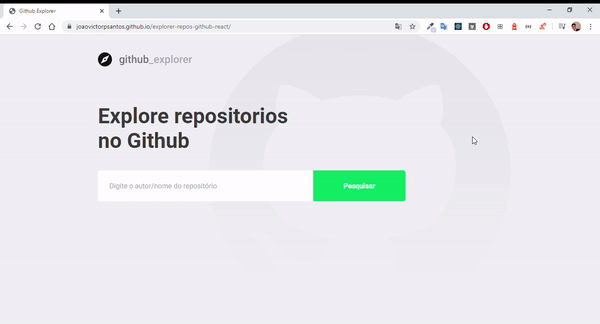

<h1 align="center">
  Explore repositórios no Github
</h1>
<h2 align="center">
Para acessar:
<a href="https://joaovictorpsantos.github.io/explorer-repos-github-react/">https://joaovictorpsantos.github.io/explorer-repos-github-react/</a><br/><br/>





</h2>

<blockquote align="center">
  Esse projeto é open-source, contribua você também :D
</blockquote>

<hr/>

## 💡 Sobre o projeto:

Este projeto feito com React visa fortalecer as bases e conceitos para poder construir uma aplicação utilizando o framework, aproveitando a API aberta do GitHub para poder fazer as requisições. Essa aplicação foi desenvolvida durante o bootcamp GoStack da Rocketseat.

## 🔥 Funcionalidades:

Através dessa aplicação conseguimos:

- Pesquisar por autor/repositório presentes no GitHub
- Verificar informações como estrelas, seguidores, issues dos repositórios
- Acessar diretamente as issues dos repositórios

## ⚙️ Tech:

- **React**

## ⛏ Ferramentas:

- [Visual Studo Code](https://code.visualstudio.com/download)

## 🏁 Executar esse projeto:

Para executar esse projeto em sua máquina,
De o clone no repositório:

```bash
$ git clone https://github.com/joaovictorpsantos/explorer-repos-github-react.git
```

Execute o comando abaixo na raiz do projeto para baixar as dependências:

```bash
yarn
```
Para executar localmente execute:

```bash
yarn start
```


<br/>

<h4 align="center">
  Vamos compartilhar conhecimento e crescer juntos!!!
</h4>

<br/>

---

<h3 align="center">
Autor: <a alt="João Victor Pereira Santos" href="https://github.com/joaovictorpsantos">João Victor Pereira Santos</a>
</h3>

<p align="center">

  <a alt="João Victor Pereira Santos Linkedin" href="https://www.linkedin.com/in/joao-victor-pereira-santos//">
    </a>
  <a alt="João Victor Pereira Santos GitHub" href="https://github.com/joaovictorpsantos">
  </a>
 <a alt="João Victor Pereira Santos Twitter" href="https://twitter.com/_joaovictorps">
  </a>

</p>
